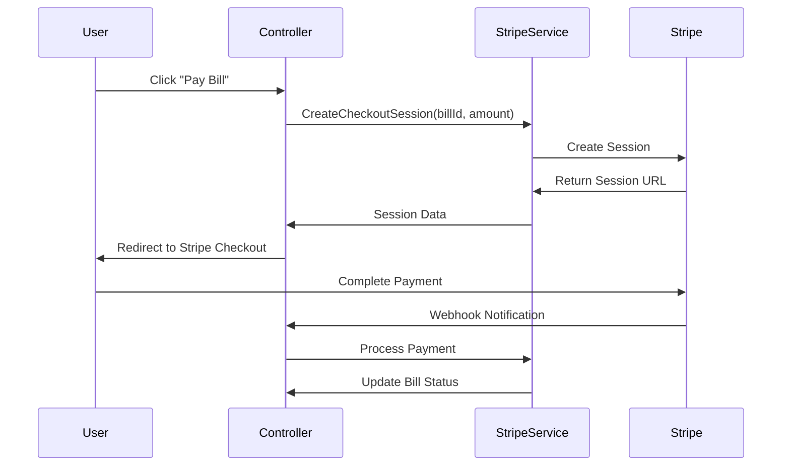

# GetMessy - Complete Project Documentation

## Table of Contents
- [Project Overview](#project-overview)
- [System Architecture](#system-architecture)
- [Features](#features)
- [Tech Stack](#tech-stack)
- [Project Structure](#project-structure)
- [Database Design](#database-design)
- [Authentication & Security](#authentication--security)
- [API Endpoints](#api-endpoints)
- [AJAX Operations](#ajax-operations)
- [Installation Guide](#installation-guide)
- [Development Workflow](#development-workflow)
- [Deployment Guide](#deployment-guide)
- [Frontend Implementation](#frontend-implementation)
- [Payment Integration](#payment-integration)
- [Contributing](#contributing)

---

## Project Overview

**GetMessy** is a comprehensive **Mess Management System** built with **ASP.NET Core 8.0 MVC** that manages hostel/cafeteria operations including user management, menu planning, attendance tracking, billing, and payment processing.

### Core Concept
The system operates on a **role-based architecture**:
- **Admin**: First registered user becomes admin with full system control
- **User**: Subsequent users can view menus, mark attendance, and pay bills

### Key Functionality
- **User Registration & Authentication** with JWT tokens
- **Menu Management** - Admins create daily menus
- **Attendance Tracking** - Users mark their attendance for meals
- **Automated Billing** - System generates bills based on attendance
- **Payment Processing** - Stripe integration for secure payments
- **PDF Generation** - Export bills and reports as PDF documents
- **Real-time Operations** - AJAX-powered updates without page refreshes

---

## System Architecture

```
┌─────────────────────────────────────────────────┐
│           User Interface (Razor Views)          │
│    Bootstrap 5 + TailwindCSS + jQuery           │
└─────────────────────────────────────────────────┘
                        ↓
┌─────────────────────────────────────────────────┐
│      ASP.NET Core 8.0 MVC Controllers           │
│  ├─ LoginController (Authentication)            │
│  ├─ RegisterController (User Creation)          │
│  ├─ AdminController (Admin Dashboard)           │
│  ├─ AdminMenuController (Menu Management)       │
│  ├─ AdminUserController (User Management)       │
│  ├─ AdminAttendanceController (Attendance)      │
│  ├─ UserMenuController (User Views)             │
│  ├─ UserBillController (Bill Management)        │
│  └─ PaymentController (Stripe Integration)      │
└─────────────────────────────────────────────────┘
                        ↓
┌─────────────────────────────────────────────────┐
│          Business Logic & Services               │
│  ├─ JwtService (Token Management)               │
│  ├─ PdfService (Document Generation)            │
│  ├─ StripeService (Payment Processing)          │
│  └─ ApplicationDbContext (Data Access)          │
└─────────────────────────────────────────────────┘
                        ↓
┌─────────────────────────────────────────────────┐
│      Entity Framework Core + SQL Server         │
│         (Database Models & ORM)                  │
└─────────────────────────────────────────────────┘
```

---

## Features

### 🔐 Authentication & Authorization
- **JWT-based authentication** with HTTP-only cookies
- **Role-based access control** (Admin/User)
- **First-user-admin** system
- **Secure password hashing**

### 👥 User Management
- **User registration** with email verification
- **Profile management**
- **Admin user oversight**
- **Role assignment**

### 🍽️ Menu Management
- **Daily menu creation** by admins
- **Multi-meal support** (Breakfast, Lunch, Dinner)
- **Price management**
- **Menu history tracking**

### 📊 Attendance Tracking
- **Real-time attendance marking**
- **Meal-wise attendance**
- **Attendance history**
- **Admin attendance overview**

### 💰 Billing System
- **Automated bill generation** based on attendance
- **Bill history tracking**
- **Payment status monitoring**
- **PDF bill export**

### 💳 Payment Integration
- **Stripe payment gateway**
- **Secure payment processing**
- **Payment history**
- **Webhook integration**

### 🎨 Modern UI/UX
- **Responsive design** with TailwindCSS
- **Bootstrap components**
- **AJAX operations** for smooth UX
- **Modern card-based layout**

---

## Tech Stack

### Backend
- **ASP.NET Core 8.0 MVC**
- **Entity Framework Core** (ORM)
- **SQL Server** (Database)
- **JWT Authentication**
- **Stripe API** (Payments)

### Frontend
- **Razor Pages** (Server-side rendering)
- **TailwindCSS** (Utility-first CSS)
- **Bootstrap 5** (Components)
- **jQuery** (DOM manipulation & AJAX)
- **Font Awesome** (Icons)

### Services
- **PdfSharp** (PDF generation)
- **BCrypt** (Password hashing)
- **Stripe.NET** (Payment processing)

---

## Project Structure

```
GetMessy/
├── Controllers/              # MVC Controllers
│   ├── AdminController.cs           # Admin dashboard
│   ├── AdminAttendanceController.cs # Attendance management
│   ├── AdminMenuController.cs       # Menu management
│   ├── AdminUserController.cs       # User management
│   ├── LoginController.cs           # Authentication
│   ├── PaymentController.cs         # Stripe payments
│   ├── RegisterController.cs        # User registration
│   ├── UserBillController.cs        # Bill management
│   └── UserMenuController.cs        # User menu views
├── Models/                   # Data Models & ViewModels
│   ├── User.cs                      # User entity
│   ├── Menu.cs                      # Menu entity
│   ├── Bill.cs                      # Bill entity
│   ├── Attendance.cs                # Attendance entity
│   ├── ErrorViewModel.cs            # Error handling
│   └── AdminAttendanceViewModel.cs  # Admin views
├── Services/                 # Business Logic Services
│   ├── JwtService.cs                # JWT token management
│   ├── PdfService.cs                # PDF generation
│   └── StripeService.cs             # Payment processing
├── Views/                    # Razor Views
│   ├── Admin/                       # Admin views
│   ├── AdminAttendance/             # Attendance views
│   ├── AdminMenu/                   # Menu management views
│   ├── AdminUser/                   # User management views
│   ├── Login/                       # Authentication views
│   ├── Payment/                     # Payment views
│   ├── Register/                    # Registration views
│   ├── Shared/                      # Shared layouts
│   ├── User/                        # User dashboard
│   ├── UserBill/                    # Bill views
│   └── UserMenu/                    # Menu views
├── Migrations/               # EF Core Migrations
├── wwwroot/                  # Static Files
│   ├── css/                         # Stylesheets
│   ├── js/                          # JavaScript files
│   └── lib/                         # Third-party libraries
├── Program.cs                # Application entry point
├── appsettings.Template.json # Configuration template
└── GetMessy.csproj          # Project file
```

---

## Database Design

### Core Entities

#### Users Table
```sql
CREATE TABLE Users (
    Id INT IDENTITY(1,1) PRIMARY KEY,
    Name NVARCHAR(100) NOT NULL,
    Email NVARCHAR(255) NOT NULL UNIQUE,
    Password NVARCHAR(255) NOT NULL,
    Role NVARCHAR(50) NOT NULL DEFAULT 'User',
    DateCreated DATETIME2 DEFAULT GETDATE()
);
```

#### Menu Table
```sql
CREATE TABLE Menu (
    Id INT IDENTITY(1,1) PRIMARY KEY,
    Date DATE NOT NULL,
    MealType NVARCHAR(50) NOT NULL,
    ItemName NVARCHAR(100) NOT NULL,
    Price DECIMAL(10,2) NOT NULL,
    DateCreated DATETIME2 DEFAULT GETDATE()
);
```

#### Attendance Table
```sql
CREATE TABLE Attendance (
    Id INT IDENTITY(1,1) PRIMARY KEY,
    UserId INT NOT NULL,
    Date DATE NOT NULL,
    MealType NVARCHAR(50) NOT NULL,
    IsPresent BIT NOT NULL DEFAULT 0,
    DateCreated DATETIME2 DEFAULT GETDATE(),
    FOREIGN KEY (UserId) REFERENCES Users(Id)
);
```

#### Bills Table
```sql
CREATE TABLE Bills (
    Id INT IDENTITY(1,1) PRIMARY KEY,
    UserId INT NOT NULL,
    Amount DECIMAL(10,2) NOT NULL,
    StartDate DATE NOT NULL,
    EndDate DATE NOT NULL,
    IsPaid BIT NOT NULL DEFAULT 0,
    DateCreated DATETIME2 DEFAULT GETDATE(),
    FOREIGN KEY (UserId) REFERENCES Users(Id)
);
```

### Relationships
- **Users** → **Attendance** (One-to-Many)
- **Users** → **Bills** (One-to-Many)
- **Menu** items are referenced by date and meal type for attendance calculation

---

## Authentication & Security

### JWT Implementation
```csharp
// JWT Service handles token creation and validation
public class JwtService
{
    public string GenerateToken(User user)
    {
        var claims = new[]
        {
            new Claim("userId", user.Id.ToString()),
            new Claim("name", user.Name),
            new Claim("email", user.Email),
            new Claim("role", user.Role)
        };
        
        var key = new SymmetricSecurityKey(Encoding.UTF8.GetBytes(_secretKey));
        var creds = new SigningCredentials(key, SecurityAlgorithms.HmacSha256);
        
        var token = new JwtSecurityToken(
            issuer: _issuer,
            audience: _audience,
            claims: claims,
            expires: DateTime.Now.AddHours(_expiryHours),
            signingCredentials: creds
        );
        
        return new JwtSecurityTokenHandler().WriteToken(token);
    }
}
```

### Security Features
- **Password Hashing** with BCrypt
- **JWT Tokens** stored in HTTP-only cookies
- **Role-based Authorization** with `[Authorize]` attributes
- **CSRF Protection** built into ASP.NET Core
- **SQL Injection Protection** via Entity Framework parameterized queries

---

## API Endpoints

### Authentication Endpoints

#### Login
```http
POST /Login/Login_Page
Content-Type: application/x-www-form-urlencoded

email=user@example.com&password=userpassword
```

**Response**: Sets JWT cookie and redirects to dashboard

#### Logout
```http
GET /Login/Logout
```

**Response**: Clears JWT cookie and redirects to login

### Admin Endpoints

#### Mark Bill as Paid (AJAX)
```http
POST /Admin/MarkPaid
Content-Type: application/x-www-form-urlencoded

billId=123
```

**Response**:
```json
{
    "success": true,
    "message": "Bill marked as paid successfully"
}
```

#### Get All Bills
```http
GET /Admin/AllBills
```

**Response**: Returns admin view with all user bills

#### User Management
```http
GET /AdminUser/Users
```

**Response**: Returns list of all users for admin management

### User Endpoints

#### View Menu
```http
GET /UserMenu/TodaysMenu
```

**Response**: Returns today's menu items

#### Mark Attendance
```http
POST /UserMenu/MarkAttendance
Content-Type: application/x-www-form-urlencoded

date=2024-01-15&mealType=Lunch
```

#### View Bills
```http
GET /UserBill/Index
```

**Response**: Returns user's bill history

### Payment Endpoints

#### Create Payment Session
```http
POST /Payment/CreateSession
Content-Type: application/json

{
    "billId": 123,
    "amount": 250.00
}
```

**Response**:
```json
{
    "sessionId": "cs_test_...",
    "url": "https://checkout.stripe.com/pay/cs_test_..."
}
```

---

## AJAX Operations

The system implements several AJAX operations for seamless user experience:

### 1. Mark Bill as Paid (Admin)
**Location**: `Views/Admin/AllBills.cshtml`

```javascript
function markPaid(billId) {
    if (!confirm('Mark this bill as paid?')) return;

    $.ajax({
        url: '/Admin/MarkPaid',
        type: 'POST',
        data: { billId: billId },
        success: function(response) {
            if (response.success) {
                showNotification('Success', response.message, 'success');
                updateBillStatus(billId, true);
            } else {
                showNotification('Error', response.message, 'error');
            }
        },
        error: function() {
            showNotification('Error', 'Failed to update bill status', 'error');
        }
    });
}
```

**Features**:
- ✅ No page refresh
- ✅ Real-time UI updates
- ✅ User confirmation dialog
- ✅ Success/error notifications
- ✅ Immediate visual feedback

### 2. Dynamic Notifications
```javascript
function showNotification(title, message, type) {
    const notification = `
        <div class="fixed top-4 right-4 bg-${type === 'success' ? 'green' : 'red'}-500 
                    text-white p-4 rounded-lg shadow-lg z-50 notification">
            <div class="flex items-center">
                <strong class="mr-2">${title}:</strong>
                <span>${message}</span>
            </div>
        </div>
    `;
    
    $('body').append(notification);
    
    setTimeout(() => {
        $('.notification').fadeOut(500, function() {
            $(this).remove();
        });
    }, 3000);
}
```

### 3. Real-time Status Updates
```javascript
function updateBillStatus(billId, isPaid) {
    const billRow = $(`[data-bill-id="${billId}"]`);
    const statusCell = billRow.find('.status-cell');
    const actionCell = billRow.find('.action-cell');
    
    if (isPaid) {
        statusCell.html('<span class="bg-green-100 text-green-800 px-2 py-1 rounded-full text-xs">Paid</span>');
        actionCell.html('<span class="text-gray-400 text-xs">Completed</span>');
    }
}
```

---

## Installation Guide

### Prerequisites
- **.NET 8 SDK** - [Download](https://dotnet.microsoft.com/download/dotnet/8.0)
- **Node.js 18+** - [Download](https://nodejs.org/) (for frontend tooling)
- **SQL Server** - LocalDB, Express, or full version
- **Git** - For version control
- **Stripe Account** - For payment processing

### Step-by-Step Setup

#### 1. Clone Repository
```bash
git clone https://github.com/your-username/GetMessy.git
cd GetMessy
```

#### 2. Configure Database
Create `appsettings.json` from template:
```bash
cp appsettings.Template.json appsettings.json
```

Edit connection string in `appsettings.json`:
```json
{
  "ConnectionStrings": {
    "DefaultConnection": "Data Source=.\\SQLEXPRESS;Initial Catalog=MessyDB;Integrated Security=true;TrustServerCertificate=true;"
  }
}
```

#### 3. Configure JWT & Stripe
Add your secrets to `appsettings.json`:
```json
{
  "JwtSettings": {
    "SecretKey": "YourSuperSecretKeyThatIsAtLeast32CharactersLong!@#$%^&*",
    "Issuer": "MessManagementSystem",
    "Audience": "MessManagementSystemUsers",
    "ExpiryInHours": 24
  },
  "Stripe": {
    "PublishableKey": "pk_test_your_publishable_key",
    "SecretKey": "sk_test_your_secret_key",
    "WebhookSecret": "whsec_your_webhook_secret"
  }
}
```

#### 4. Install Dependencies
```bash
# Restore .NET packages
dotnet restore

# Install Node.js packages (for TailwindCSS)
npm install
```

#### 5. Setup Database
```bash
# Run migrations
dotnet ef database update

# Or run the SQL script directly
sqlcmd -S .\SQLEXPRESS -d MessyDB -i MSSQL_DATABASE_SETUP.sql
```

#### 6. Build Frontend Assets
```bash
# Build TailwindCSS
npm run build

# Or watch for changes during development
npm run dev
```

#### 7. Run Application
```bash
dotnet run
```

The application will start at `https://localhost:5001`

### First Time Setup
1. Navigate to `https://localhost:5001`
2. Register the first user (becomes Admin automatically)
3. Login and start managing the mess system

---

## Development Workflow

### Daily Development Process

#### 1. Feature Development
```bash
# Create feature branch
git checkout -b feature/new-feature-name

# Make changes
# Test locally with 'dotnet run'

# Commit changes
git add .
git commit -m "Add new feature description"

# Push and create PR
git push origin feature/new-feature-name
```

#### 2. Database Changes
```bash
# Create migration for model changes
dotnet ef migrations add MigrationName

# Apply migration
dotnet ef database update

# Review generated migration files in Migrations/
```

#### 3. Frontend Development
```bash
# Watch TailwindCSS for changes
npm run dev

# Build for production
npm run build
```

### Code Organization Standards

#### Controllers
- Keep controllers thin - move business logic to services
- Use proper HTTP status codes
- Implement proper error handling
- Follow RESTful conventions

#### Services
- Implement business logic in dedicated service classes
- Use dependency injection
- Make services testable and reusable
- Handle exceptions appropriately

#### Views
- Use consistent naming conventions
- Implement responsive design patterns
- Follow accessibility guidelines
- Minimize inline CSS/JS

---

## Deployment Guide

### Hosting Options

#### Option 1: Azure App Service (Recommended)
```bash
# Install Azure CLI
az login

# Create resource group
az group create --name MessyAppRG --location "East US"

# Create App Service plan
az appservice plan create --name MessyPlan --resource-group MessyAppRG --sku FREE

# Create web app
az webapp create --resource-group MessyAppRG --plan MessyPlan --name your-messy-app --runtime "DOTNET|8.0"

# Deploy from local Git
az webapp deployment source config-local-git --name your-messy-app --resource-group MessyAppRG

# Configure connection strings via Azure Portal
```

#### Option 2: Railway
1. Push code to GitHub
2. Connect repository to Railway
3. Set environment variables
4. Auto-deploy on push

#### Option 3: Self-Hosted (IIS/Linux)
```bash
# Publish release build
dotnet publish -c Release -o ./publish

# Copy to server and configure web server
```

### Environment Configuration

#### Production appsettings.json
```json
{
  "Logging": {
    "LogLevel": {
      "Default": "Warning",
      "Microsoft.AspNetCore": "Warning"
    }
  },
  "ConnectionStrings": {
    "DefaultConnection": "Data Source=prod-server;Initial Catalog=MessyProd;User Id=produser;Password=prodpass;"
  },
  "AllowedHosts": "*",
  "JwtSettings": {
    "SecretKey": "ProductionSecretKeyMustBe32CharactersOrMore!@#$%^&*",
    "Issuer": "MessManagementSystem",
    "Audience": "MessManagementSystemUsers",
    "ExpiryInHours": 24
  },
  "Stripe": {
    "PublishableKey": "pk_live_your_live_publishable_key",
    "SecretKey": "sk_live_your_live_secret_key",
    "WebhookSecret": "whsec_your_live_webhook_secret"
  }
}
```

### Database Migration in Production
```bash
# Apply migrations in production
dotnet ef database update --connection "YourProductionConnectionString"

# Or use SQL scripts
sqlcmd -S prod-server -d MessyProd -U produser -P prodpass -i MSSQL_DATABASE_SETUP.sql
```

---

## Frontend Implementation

### TailwindCSS Configuration
File: `tailwind.config.js`
```javascript
module.exports = {
  content: ["./Views/**/*.{html,js,cshtml}", "./wwwroot/**/*.{html,js}"],
  theme: {
    extend: {
      colors: {
        'apple-blue': '#007AFF',
        'apple-gray': '#F2F2F7'
      }
    },
  },
  plugins: [],
}
```

### CSS Architecture
- **TailwindCSS** for utility classes
- **Custom CSS** in `wwwroot/css/site.css` for overrides
- **Bootstrap** for complex components
- **Font Awesome** for icons

### JavaScript Architecture
```javascript
// Global functions in site.js
function showNotification(title, message, type) { /* ... */ }
function confirmAction(message, callback) { /* ... */ }

// Page-specific scripts
function markPaid(billId) { /* AJAX call */ }
function updateAttendance(userId, date, meal) { /* ... */ }
```

---

## Payment Integration

### Stripe Configuration

#### Setup Process
1. Create Stripe account at https://stripe.com
2. Get API keys from Dashboard
3. Configure webhook endpoints
4. Add keys to `appsettings.json`

#### Payment Flow


#### StripeService Implementation
```csharp
public class StripeService
{
    public async Task<Session> CreateCheckoutSessionAsync(int billId, decimal amount)
    {
        var options = new SessionCreateOptions
        {
            PaymentMethodTypes = new List<string> { "card" },
            LineItems = new List<SessionLineItemOptions>
            {
                new SessionLineItemOptions
                {
                    PriceData = new SessionLineItemPriceDataOptions
                    {
                        UnitAmount = (long)(amount * 100),
                        Currency = "usd",
                        ProductData = new SessionLineItemPriceDataProductDataOptions
                        {
                            Name = $"Mess Bill #{billId}",
                        },
                    },
                    Quantity = 1,
                },
            },
            Mode = "payment",
            SuccessUrl = $"{Request.Scheme}://{Request.Host}/Payment/Success?billId={billId}",
            CancelUrl = $"{Request.Scheme}://{Request.Host}/UserBill",
            Metadata = new Dictionary<string, string>
            {
                { "bill_id", billId.ToString() }
            }
        };

        var service = new SessionService();
        return await service.CreateAsync(options);
    }
}
```

---

## Contributing

### Getting Started
1. Fork the repository
2. Create a feature branch: `git checkout -b feature/your-feature`
3. Make your changes
4. Write/update tests
5. Submit a pull request

### Code Style Guidelines
- Follow C# naming conventions
- Use async/await for I/O operations
- Implement proper error handling
- Write meaningful commit messages
- Add XML documentation for public methods

### Pull Request Process
1. Ensure all tests pass
2. Update documentation as needed
3. Add screenshots for UI changes
4. Request review from maintainers

---

## License

This project is developed for educational purposes as part of a university coursework in Enterprise and Application Development.

---

## Support & Contact

For questions, issues, or contributions:
- Create an issue on GitHub
- Email: [your-email@university.edu]
- University: University of Engineering and Technology (UET)

---

**Happy Coding! 🎉**